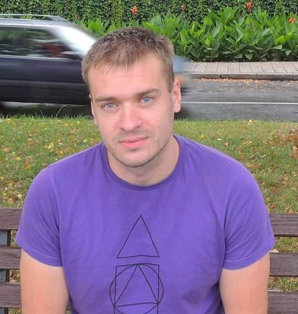

#  Perats Viachaslau


## Contact
  - E-mail: peretsviach@gmail.com
  - Phone: +48578179521
  - Telegram: slawik2103 
  - Discord: Slawaper
  - Address: Poland, Krakow

## About Me
I am 26. I am a hygienist and epidemiologist by profession. Graduated from the university in 2019 in Belarus. I currently live in Krakow, Poland. I am purposeful, hardworking, sociable. I want to gain skills in front-end development and further apply them in my work.

## Skills
  - JS, basic
  - HTML, basic
  - CSS, basic
  - VS Code

## Code Example

```
function multiply(number){
  let stringNum = String(number);
  if (stringNum.includes('-')){
      return number * (5**(stringNum.length - 1))
      }
  return number * (5**stringNum.length)
}
```
    
## Experience
  - 3 months of work as a doctor in the medical institution "Pinsk Center for Hygiene and Epidemiology"
  - I don't have  experience in front-end development

## Education
  - University: 2013-2019 Belarusian State Medical University
  - 1 year internship at the medical institution "Pinsk Center for Hygiene and Epidemiology"
  - Courses:
      + [JS/FE Pre-School](https://app.rs.school/certificate/5p26191r)

## English
**A1** \(in the process of studying\)
